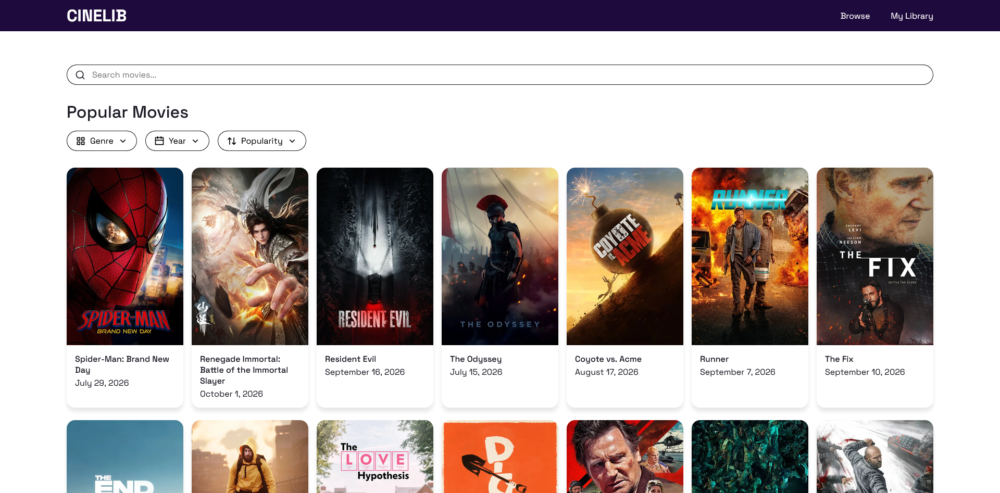
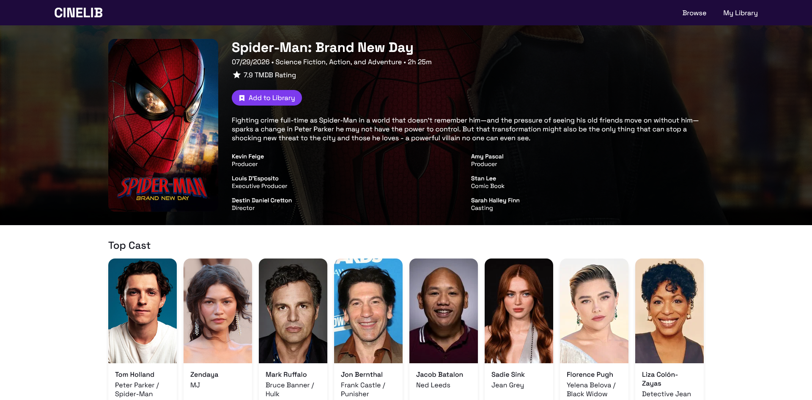
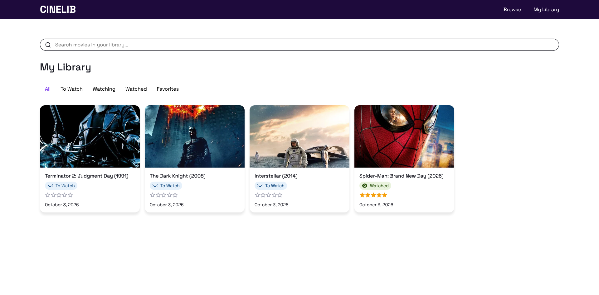

# CineLib

## 1. Overview

CineLib is a movie-tracking web application for discovering and organizing movies. Users can browse movies from TMDB, save movies to their personal library, and manage their watch status, ratings, notes, and favorites.

## 2. Setup and Installation

### Requirements

- Docker Desktop
- Git
- TMDB API key

### Get the Project

```bash
git clone https://github.com/gianworks/cinelib.git
cd cinelib
```

### Environment Configuration

Create a `.env` file in the project root:

```env
POSTGRES_USER=postgres
POSTGRES_PASSWORD=change_me
POSTGRES_DB=cinelib

DATABASE_URL=postgresql://postgres:change_me@db:5432/cinelib
PORT=3000

VITE_TMDB_API_KEY=your_tmdb_api_key
```

Replace change_me with a password of your choice and add your TMDB API key.

### Database Setup

PostgreSQL and the cinelib database are created automatically by Docker.

The server automatically creates the library_movies table when the application starts.

No seed data is required. Movies are added through the application.

The current database table:

```sql
library_movies

id
tmdb_id
watch_status
rating
notes
is_favorite
date_added
```

## 3. How to Run It

Make sure Docker Desktop is running.

From the project root, run:

```
docker compose up --build
```

When the containers are running, open:

```
http://localhost:5173
```

The CineLib Browse page should appear with movies loaded from TMDB.

To stop the application:

```
docker compose down
```

## 4. Features and Usage

### Browse
- Browse movies from TMDB
- Search and filter movies
- View movie details
- Add movies to the library

### My Library
- View saved movies
- Search and filter library movies
- Change watch status
- Add, edit, or remove ratings and notes
- Mark or unmark favorites
- Remove movies from the library

### Watch Status

Movies can be set to:

- To Watch
- Watching
- Watched

### Library API

| Method | Endpoint                     | Description                            |
| ------ | ---------------------------- | -------------------------------------- |
| GET    | `/api/library`               | Get library movies                     |
| POST   | `/api/library`               | Add a movie                            |
| PUT    | `/api/library/:tmdbId`       | Update a library movie                 |
| DELETE | `/api/library/:tmdbId`       | Remove a library movie                 |

---

## 5. Project Structure

```
cinelib
│
├── client
│   ├── src
│   │   ├── api
│   │   ├── components
│   │   ├── features
│   │   ├── styles
│   │   ├── types
│   │   ├── App.tsx
│   │   └── main.tsx
│   │
│   └── package.json
│
├── server
│   ├── src
│   │   ├── config
│   │   ├── controllers
│   │   ├── models
│   │   ├── routes
│   │   ├── services
│   │   ├── app.ts
│   │   └── server.ts
│   │
│   └── package.json
│
├── AI-USAGE.md
├── docker-compose.yml
└── README.md
```

## 6. Screenshots

### Browse Page



### Movie Details Page



### My Library Page



## AI Usage

AI was used during development for planning, implementation guidance, debugging, and documentation. AI-generated suggestions were reviewed, modified, and tested during development.

See [AI-USAGE.md](./AI-USAGE.md) for the complete AI usage record.
